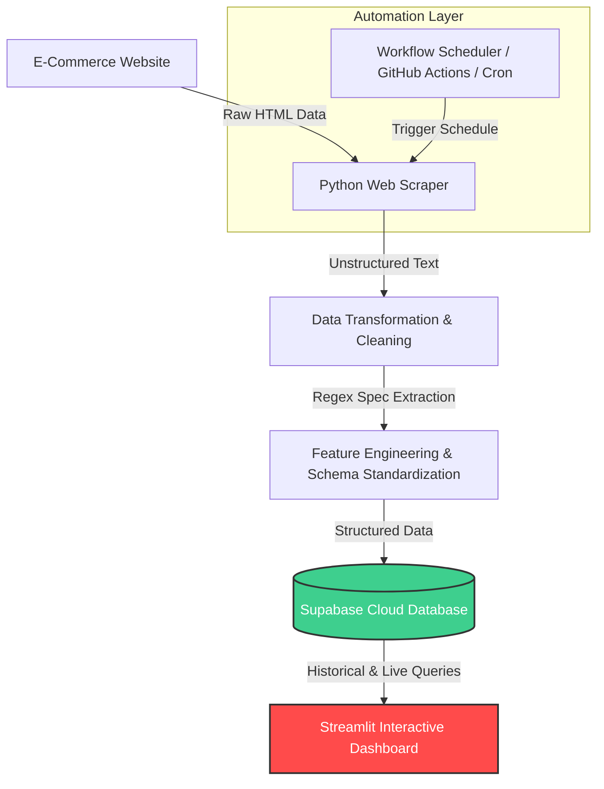

# 💻 Engineering an Automated Data Pipeline to Track Laptop Prices and Market Changes

An end-to-end data engineering and analytics pipeline built to transform chaotic e-commerce product listings into structured, historical market insights. This system automates data collection, standardizes messy text specifications, tracks price fluctuations over time, and delivers clear metrics via an interactive dashboard.

---

## 📌 Project Overview & Context

Buying a laptop online can be overwhelming—prices fluctuate daily, and crucial specifications (CPU, RAM, GPU) are often buried inside messy, unstructured text descriptions. 

Unlike standard data science tutorials that rely on static, clean CSV files, this project tackles **real-world data engineering challenges**. It builds a scalable market intelligence tool that tracks how prices *actually* change over time, empowering non-technical consumers to score the best deals within their budget.

> 🛠️ **Hardware Constraints Note:** This entire end-to-end pipeline, database integration, and dashboard tracking system were developed and tested using a legacy **Acer Core i5 laptop from 2012**. Proof that impactful data infrastructure can be built under strict physical hardware limitations through optimized and efficient code.

---

## 🏗️ System Architecture & Data Flow

The pipeline automatically orchestrates data from live web structures down to a cloud-hosted analytical layer, visualization, and deployment.

---

### Key Stages Breakdown:

1. **Automated Data Collection:** Eliminates manual price checks by programmatically extracting laptop listings.
2. **Advanced Feature Engineering:** Uses custom parsing logic to isolate messy text strings into explicit categorical components (e.g., extracting `8GB` to `RAM_Size_GB`, `i7-12700H` to `CPU_Series`).
3. **Cloud Data Warehousing:** Stores processed data in **Supabase (PostgreSQL)** to capture historical pricing trends instead of just snapshot data.
4. **Data Democratization:** Exposes market dynamics to end-users via an interactive web interface.

---

## 📊 Dashboard Preview

Below is the live tracking interface built to filter market noise and pinpoint high-value laptop deals based on calculated price-to-performance metrics.

---

## 🛠️ Tech Stack & Tools

* **Language:** Python
* **Data Libraries:** Pandas, NumPy, Beautiful Soup / Scrapy
* **Database & Cloud:** Supabase (Cloud PostgreSQL)
* **Automation:** Workflow Schedulers / Cron Job Infrastructure
* **Visualization:** Streamlit Framework
* **Development Environment:** Linux (Zorin OS)

---

## 🚀 Key Insights Delivered

* **Price History Tracking:** Identifies true discounts vs. artificial price hikes by analyzing historical pricing curves.
* **Specification Standardization:** Simplifies cross-brand comparison (Asus, Lenovo, Acer, HP) by uniforming hardware specs.
* **Market Dynamics Monitoring:** Tracks which price tiers fluctuate the most in response to market demands.

---

## 📬 Connect with Me

If you have any questions about the data schema, pipeline orchestration, or want to discuss Data Engineering & AI solutions, feel free to reach out!

* **LinkedIn:** [wira-dhana-putra](https://www.linkedin.com/in/wira-dhana-putra/)
* **Medium Articles:** [@wiradp](https://medium.com/@wiradp)
* **Portfolio Website:** [wiradp.github.io](https://wiradp.github.io/)
* **GitHub Profile:** [@wiradp](https://github.com/wiradp)

